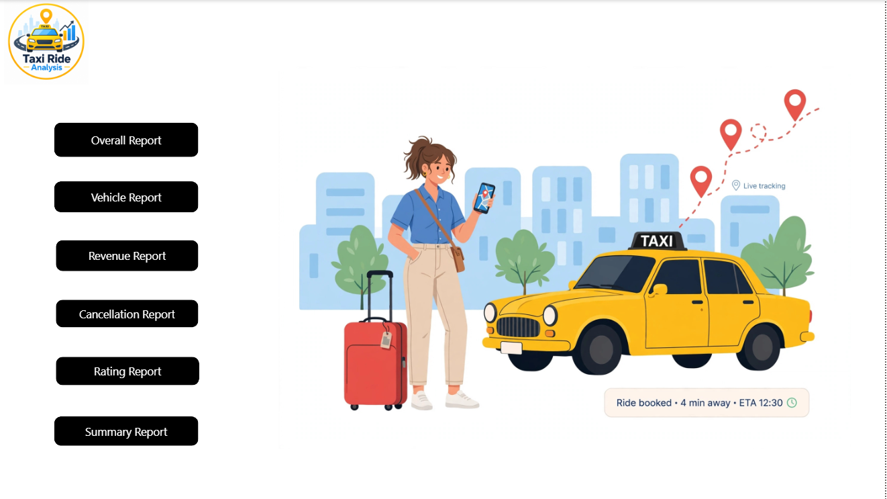
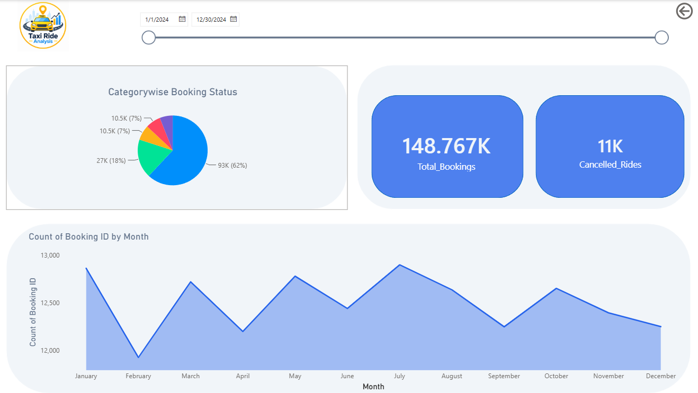
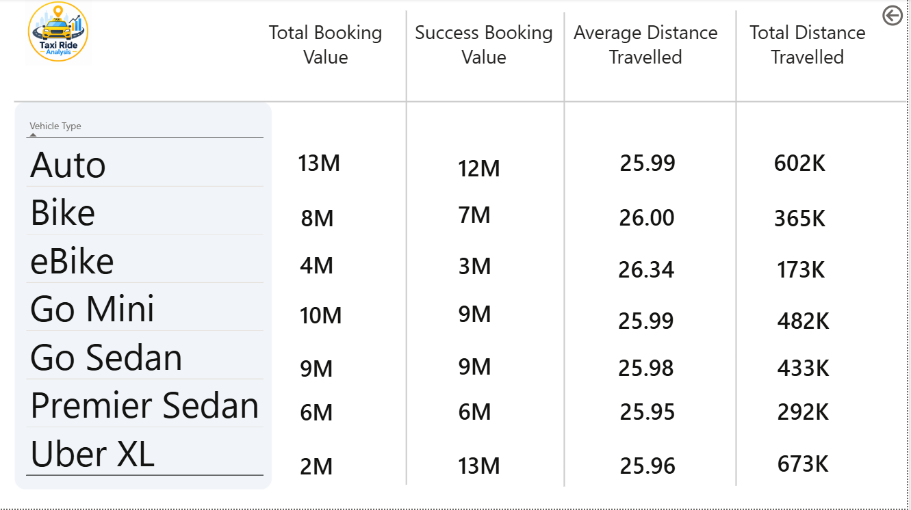
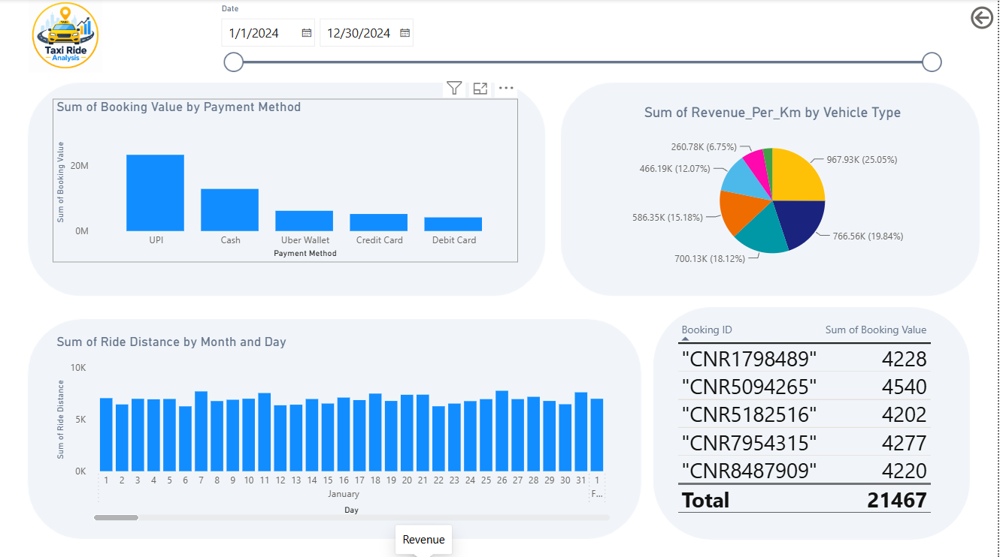
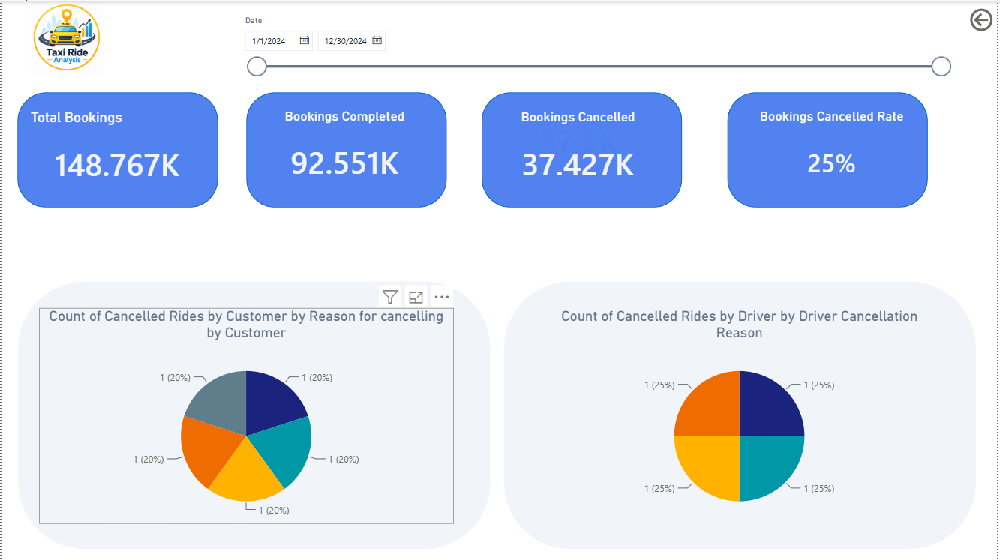
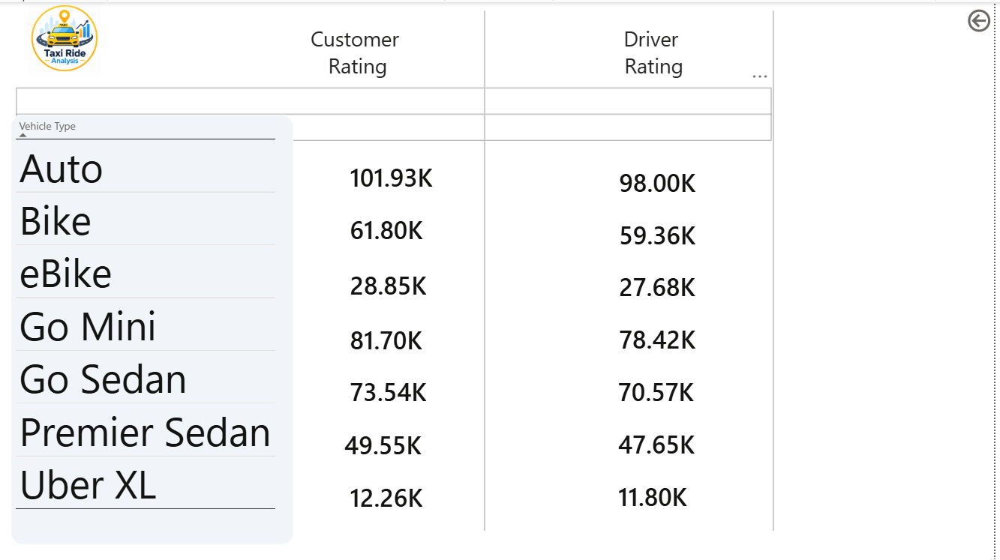
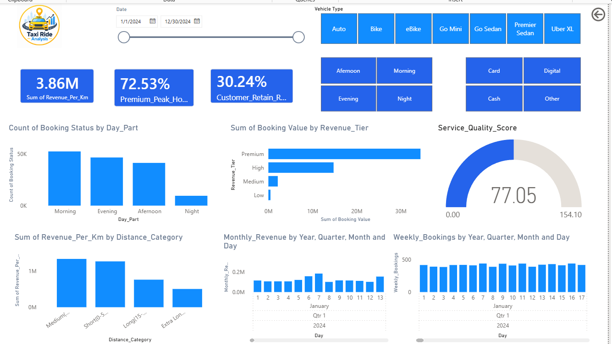

# 🚕 Taxi Ride Analysis Dashboard | Power BI


## 📊 Project Overview
**Taxi Ride Analysis** is an interactive Data Analytics and Business Intelligence dashboard developed using **Microsoft Power BI**.

The project analyzes taxi booking data to understand booking performance, cancellations, revenue, vehicle performance, customer and driver ratings, ride distance, payment methods, and overall business KPIs.

The dashboard is designed with multiple interactive report pages to provide a clear and user-friendly view of taxi business performance.
---
## 🎯 Project Objectives
The main objectives of this project are:
- Analyze total taxi bookings
- Track completed and cancelled bookings
- Calculate cancellation rate
- Analyze vehicle-wise performance
- Analyze revenue and booking value
- Compare different payment methods
- Analyze customer and driver ratings
- Analyze ride distance trends
- Identify monthly and daily booking trends
- Monitor important business KPIs
- Provide an interactive business intelligence dashboard
---
## 🛠️ Tools & Technologies
| Tool | Purpose |
|---|---|
| **Microsoft Power BI** | Dashboard & Data Visualization |
| **Power Query** | Data Cleaning & Transformation |
| **DAX** | Calculated Measures & KPIs |
| **Excel / CSV** | Data Source |
| **Data Analytics** | Business Insights |
---
# 📌 Dashboard Pages
## 🏠 1. Home Page
The Home Page provides navigation to different sections of the dashboard.
Available reports:
- Overall Report
- Vehicle Report
- Revenue Report
- Cancellation Report
- Rating Report
- Summary Report

---
## 📊 2. Overall Analysis
The Overall Report provides a high-level overview of taxi booking performance.
### Key Metrics
- Total Bookings
- Completed Bookings
- Cancelled Bookings
- Cancellation Rate
- Category-wise Booking Status
- Monthly Booking Trends

---
## 🚗 3. Vehicle Analysis
The Vehicle Report compares performance across different vehicle categories.
### Vehicle Types
- Auto
- Bike
- eBike
- Go Mini
- Go Sedan
- Premier Sedan
- Uber XL
### Metrics
- Customer Rating
- Driver Rating
- Total Booking Value
- Successful Booking Value
- Average Distance Travelled
- Total Distance Travelled


---
## 💰 4. Revenue Analysis
The Revenue Report focuses on booking value, revenue and ride-distance analysis.
### Analysis Includes
- Booking Value by Payment Method
- Revenue per Kilometer
- Revenue by Vehicle Type
- Ride Distance by Day
- Booking Value
- Revenue Trends

### Payment Methods

- UPI
- Cash
- Uber Wallet
- Credit Card
- Debit Card



---
## ❌ 5. Cancellation Analysis
The Cancellation Report analyzes cancelled rides and their reasons.
### Analysis Includes
- Customer Cancellations
- Driver Cancellations
- Customer Cancellation Reasons
- Driver Cancellation Reasons
- Cancelled Booking Count
- Cancellation Rate



---
## ⭐ 6. Rating Analysis
The Rating Report compares customer and driver ratings across different vehicle types.
### Analysis Includes
- Customer Rating
- Driver Rating
- Vehicle-wise Rating Comparison


---
## 📋 7. Summary Report
The Summary Report provides a consolidated view of important business metrics.
### Key Metrics & Analysis
- Revenue per Kilometer
- Premium Peak Hour %
- Customer Retention Rate
- Booking Status by Day Part
- Revenue Tier
- Service Quality Score
- Distance Category
- Monthly Revenue
- Weekly Bookings



---

# 📈 Key KPIs
The dashboard tracks several important business KPIs:
- **Total Bookings**
- **Completed Bookings**
- **Cancelled Bookings**
- **Cancellation Rate**
- **Total Booking Value**
- **Successful Booking Value**
- **Revenue per Kilometer**
- **Average Distance Travelled**
- **Total Distance Travelled**
- **Customer Rating**
- **Driver Rating**
- **Service Quality Score**
- **Customer Retention Rate**
---
# 🔍 Business Questions Answered
This dashboard helps answer questions such as:

1. What is the total number of taxi bookings?
2. How many bookings were successfully completed?
3. What percentage of bookings were cancelled?
4. Which vehicle types generate higher booking value?
5. Which payment method contributes the most booking value?
6. How does revenue change over time?
7. How do customer and driver ratings compare?
8. What are the major reasons for cancellations?
9. Which part of the day has the highest booking volume?
10. How does ride distance vary across different periods?
11. Which vehicle categories generate higher revenue per kilometer?
12. How does booking performance change month by month?
---
# 💡 Key Insights
The dashboard can be used by business teams to:
- Monitor overall booking performance
- Identify cancellation patterns
- Compare vehicle categories
- Understand customer behavior
- Analyze revenue performance
- Track service quality
- Monitor customer and driver ratings
- Identify high-performing payment methods
- Analyze peak booking periods
- Support data-driven business decisions
---
# 📂 Project Structure
```text
Taxi-Ride-Analysis-PowerBI/
│
├── README.md
│
├── PowerBI/
│   └── Taxi_Ride_Analysis.pbix
│
├── Dashboard_Screenshots/
│   ├── HomePage.png
│   ├── Overall.png
│   ├── Vehicle.png
│   ├── Revenue.png
│   ├── Cancellation.png
│   ├── Rating.png
│   └── SummaryPage.png
│
├── Data/
│   └── README.md
│
└── Documentation/
    └── Project_Overview.md
